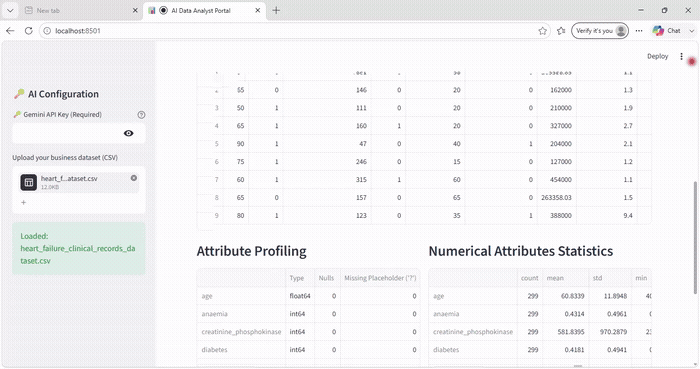
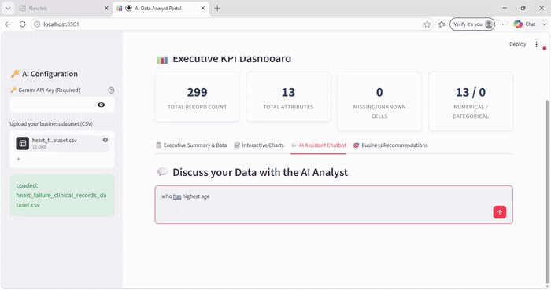

# 📊 AI Data Analyst Portal

An interactive **Streamlit** web app that turns any CSV file into a full business analytics dashboard — complete with automated profiling, interactive charts, an AI chat assistant powered by **Google Gemini**, and auto-generated business recommendations.

Upload a dataset, and the app instantly builds an executive KPI dashboard, lets you explore and visualize the data, and lets you ask natural-language questions that get translated into pandas code, executed, and explained back to you in plain English.

---

## ✨ Features

- **📋 Automatic Dataset Profiling** — Ingests and cleans any CSV, detects column types, missing values, and placeholder characters (`?`), and auto-renames misaligned target columns.
- **📈 Interactive Chart Builder** — Build Histograms, Bar Plots, Scatter Plots, and Box Plots on the fly by selecting X/Y axes and grouping variables — no code required.
- **💬 AI Assistant Chatbot** *(requires Gemini API key)* — Ask questions about your data in plain English. The app uses the Gemini API to generate pandas code, execute it safely, self-correct on errors, and return a business-analyst-style explanation. Without an API key, this tab will prompt you to enter one and will not run.
- **🎯 Business Recommendations** — Auto-generates tailored, actionable insights based on the dataset type (currently includes smart detection for census/income and e-commerce/sales datasets, plus a generic fallback for any other data).
- **📊 Executive KPI Dashboard** — Instant top-level metrics: record count, attribute count, missing data count, and a dataset-specific headline KPI.

---

## 🖥️ Demo Preview

> Upload any CSV (e.g. a census/income dataset or e-commerce sales dataset) via the sidebar to get started. No file? The app still runs — it just prompts you to upload one. The KPI dashboard, charts, and recommendations work without any API key — only the **AI Assistant Chatbot** tab requires a Gemini API key to function.

**Dataset upload → Interactive charts → KPI Dashboard**



**AI Assistant Chatbot in action**



---

## 🛠️ Tech Stack

| Layer            | Technology                     |
|-------------------|--------------------------------|
| Frontend/App      | [Streamlit](https://streamlit.io/) |
| Data Processing   | pandas, NumPy                  |
| Visualization     | Matplotlib, Seaborn            |
| AI / LLM          | Google Gemini API (`gemini-2.5-flash`) |
| Language          | Python 3.10+                   |

---

## 📁 Project Structure

```
ai-data-analyst-portal/
├── app.py              # Main Streamlit application
├── query.py             # Standalone CLI helper for ad-hoc pandas queries (local use only)
├── requirements.txt      # Python dependencies
└── README.md
```

> **Note:** `query.py` is a local command-line utility for quick pandas queries against a hardcoded CSV path and is **not** used by `app.py`. It's optional and not required to run the Streamlit app.

---

## 🚀 Getting Started (Local Setup)

### 1. Clone the repository
```bash
git clone https://github.com/<your-username>/ai-data-analyst-portal.git
cd ai-data-analyst-portal
```

### 2. Create a virtual environment (recommended)
```bash
python -m venv venv
source venv/bin/activate    # On Windows: venv\Scripts\activate
```

### 3. Install dependencies
```bash
pip install -r requirements.txt
```

### 4. Run the app
```bash
streamlit run app.py
```

The app will open automatically at `http://localhost:8501/`.

### 5. Add your Gemini API key (required for the AI Chatbot)
The app works out-of-the-box for dataset profiling, KPI dashboards, charts, and recommendations — **no key needed** for those.

However, the **AI Assistant Chatbot** tab **will not function without a Gemini API key**. To use it:
1. Get a free API key from [Google AI Studio](https://aistudio.google.com/app/apikey).
2. Paste it into the sidebar field labeled **"Gemini API Key"** when the app is running.
3. If the field is left empty, the chatbot tab will show a warning (*"Gemini API Key Missing"*) instead of answering your question.

> The key is entered per-session in the UI and is never stored or committed to the repo.

---

## ☁️ Deploying to Streamlit Community Cloud

1. Push this repo to GitHub (see steps below).
2. Go to [share.streamlit.io](https://share.streamlit.io/) and sign in with GitHub.
3. Click **New app**, select this repository, branch, and set the main file path to `app.py`.
4. Click **Deploy**.
5. (Optional) If you want a default Gemini key available without users entering their own, add it under **App settings → Secrets** as:
   ```toml
   GEMINI_API_KEY = "your-key-here"
   ```
   and update `app.py` to read from `st.secrets["GEMINI_API_KEY"]` as a fallback.

---

## 📤 Pushing This Project to GitHub

```bash
git init
git add .
git commit -m "Initial commit: AI Data Analyst Portal"
git branch -M main
git remote add origin https://github.com/<your-username>/ai-data-analyst-portal.git
git push -u origin main
```

---

## 📌 Usage Tips

- Works best with tabular business datasets (e.g. sales, census/income, customer data).
- The app auto-detects **census/income-style** and **e-commerce/sales-style** datasets to tailor summaries and recommendations; any other dataset gets a generic profile.
- Missing values and `?` placeholders are automatically counted and surfaced in the KPI dashboard.

---

## 🔒 Notes on API Key Security

- Never commit your Gemini API key to the repository.
- If deploying publicly, prefer Streamlit's **Secrets Manager** over hardcoding keys.
- Add a `.gitignore` entry for any local `.env` or secrets files if you add them later.

---

## 📄 License

This project is open-source. Add your preferred license (e.g. MIT) here.
